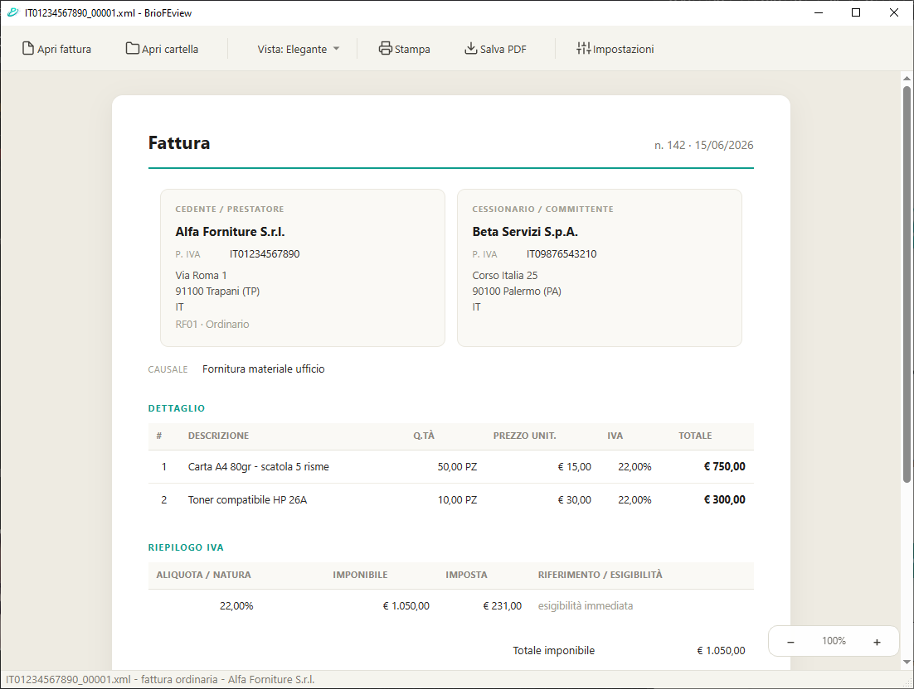

<p align="center">
  
</p>

<h1 align="center">BrioFEview</h1>

<p align="center">
  Visualizza, stampa ed esporta in PDF le fatture elettroniche italiane (XML e P7M).
</p>

<p align="center">
  <a href="https://github.com/denvermotel/BrioFEview">Repository GitHub</a> ·
  <a href="https://denvermotel.github.io/BrioFEview/">Sito e guida</a> ·
  <b>v0.1 beta</b>
</p>

---

## Cos'è

BrioFEview è un'applicazione desktop (Windows, con supporto macOS) per aprire,
leggere, stampare ed esportare in PDF le fatture elettroniche italiane in
formato XML, comprese quelle firmate digitalmente in **P7M** (CAdES). Nasce
per l'uso quotidiano in studio: niente più lettura di XML grezzo o passaggi
manuali per ottenere un PDF stampabile.

## Funzionalità

- **Apertura diretta di XML e P7M** - riconosce ed estrae automaticamente il
  contenuto delle fatture firmate, senza passaggi manuali.
- **Quattro formati di visualizzazione**, selezionabili dalla toolbar:
  - **Elegante**: formato proprietario dell'app: decodifica i codici della
    fattura (modalità di pagamento, regime fiscale, natura IVA, tipo
    documento...) in etichette leggibili, con un'impaginazione pensata per
    la lettura veloce.
  - **Ministeriale**: il foglio di stile ufficiale dell'Agenzia delle Entrate.
  - **AssoSoftware**: il foglio di stile alternativo diffuso tra i software
    gestionali italiani.
  - **Codice XML**: il contenuto XML grezzo, riformattato ed evidenziato
    con numeri di riga, utile per il debug.
- **Stampa e PDF, singola o in massa**: salva o stampa una fattura alla
  volta, oppure un'intera cartella: PDF singoli, un unico PDF con
  segnalibri, o stampa diretta di tutte le fatture selezionate.
- **Modalità cartella**: apri un'intera cartella, sfoglia l'elenco nella
  barra laterale e scegli quali fatture includere nell'esportazione.
- **Integrazione con Windows**: associa `.xml` e `.p7m` all'app dal menu
  "Apri con" o come programma predefinito, direttamente dalle Impostazioni.

## Screenshot



## Installazione

### Windows

Sono disponibili tre modalità, dalla più comoda alla più flessibile:

1. **Installer** (`BrioFEview_Setup_0.1-beta.exe`) - installazione guidata
   in italiano, con collegamenti su Desktop/Menu Avvio e possibilità di
   associare `.xml`/`.p7m` all'app (scelta con checkbox durante il setup,
   modificabile in seguito dalle Impostazioni dell'app). Non richiede
   diritti di amministratore.
2. **Versione portable** (`BrioFEview_Portable.exe`) - un unico file,
   nessuna installazione: si può eseguire da una chiavetta USB o da
   qualunque cartella. Al primo avvio si autoestrae in una cartella
   temporanea (i successivi sono più rapidi).
3. **Dai sorgenti** (richiede Python 3.11+):
   ```powershell
   pip install -r requirements.txt
   python -m visualizzatore
   ```
   In alternativa, doppio clic su `Avvia BrioFEview.bat` (usa Python se
   disponibile, altrimenti l'eventuale eseguibile compilato in `dist/`). Il
   file accetta anche un file o una cartella trascinati sopra di esso.

Sia l'installer sia la versione portable si generano con i comandi descritti
in [Build dell'eseguibile](#build-delleseguibile) e non sono ancora allegati
alle Release del repository in questa fase beta.

### macOS

```bash
chmod +x avvia_briofeview.command
./avvia_briofeview.command
```

Al primo avvio lo script crea automaticamente un ambiente virtuale locale
(`.venv`) e installa le dipendenze.

## Utilizzo

1. **Apri un file o una cartella** - dal pulsante in toolbar, con "Apri con"
   da Esplora Risorse, oppure trascinando il file o la cartella nella
   finestra dell'app.
2. **Scegli il formato** - dal menu "Vista" seleziona Elegante,
   Ministeriale, AssoSoftware o Codice XML.
3. **Stampa o salva il PDF** - con i pulsanti in toolbar, senza
   configurazione aggiuntiva.
4. **Esporta un'intera cartella** - con la barra laterale aperta, seleziona
   le fatture da includere e usa "Esporta cartella" per PDF multipli o
   un unico PDF con segnalibri.

## Struttura del progetto

```
visualizzatore/
├── __main__.py          punto di ingresso (python -m visualizzatore [file|cartella])
├── core/                 caricamento fatture, estrazione p7m, trasformazioni XSLT,
│                         formato Elegante, esportazione PDF
├── ui/                   finestra principale, dialoghi (batch, impostazioni), icone
├── utils/                associazioni file di Windows, risoluzione risorse
└── resources/            fogli di stile XSLT, icone, tema (QSS)

packaging/                build PyInstaller e installer Inno Setup
docs/                     sito di presentazione (GitHub Pages)
```

## Build dell'eseguibile

```powershell
pip install pyinstaller

# versione con installer (cartella dist\BrioFEview\)
python -m PyInstaller packaging\build.spec --noconfirm

# versione portable, file singolo (dist\BrioFEview_Portable.exe)
python -m PyInstaller packaging\build_portable.spec --noconfirm
```

Per creare l'installer Windows a partire dalla build in `dist\BrioFEview\`
serve [Inno Setup 6](https://jrsoftware.org/isinfo.php):

```powershell
iscc packaging\installer.iss
```

Produce `dist\installer\BrioFEview_Setup_0.1-beta.exe`.

## Stato del progetto

BrioFEview è in fase **beta (v0.1)**: le funzionalità principali sono
implementate e testate, ma l'app non ha ancora ricevuto un ciclo esteso di
utilizzo su fatture reali eterogenee. Segnalazioni e feedback sono benvenuti
tramite le [Issue](https://github.com/denvermotel/BrioFEview/issues) del
repository.

## Licenza

Distribuito con licenza [GPL-3.0](LICENSE).

## Autore

**Giovanni Genna** - [github.com/denvermotel](https://github.com/denvermotel)
